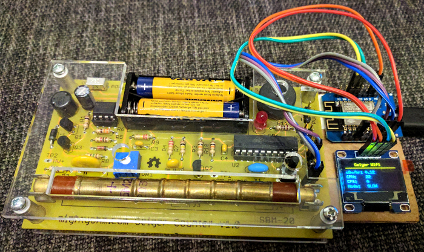
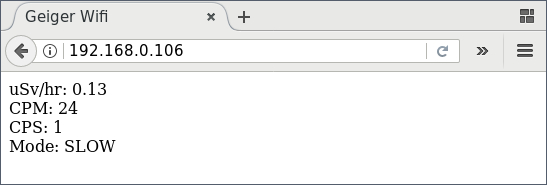
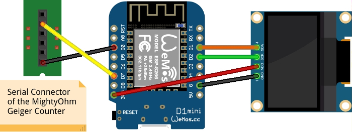

Geiger Wifi
===========

Show the measurements from your [MightyOhm Geiger Counter](http://mightyohm.com/blog/products/geiger-counter/)
on a OLED display as well as on a website in your local Wifi.

The System
----------

This is what the setup looks like looks like.  

This is what the website look like, which is provided by the ESP8266.  

Requirements
------------

* A [MightyOhm Geiger Counter](http://mightyohm.com/blog/products/geiger-counter/) kit.
* A cheap I2C-based OLED display [like this one from Amazon](TODO).
* An ESP8266 SoC running the [NodeMcu firmware](http://nodemcu.com/).
  I used the [WeMos D1 Mini](https://www.wemos.cc/product/d1-mini.html).
* Some wires, pin headers, etc.

Setup
-----

* Wire everything up according to this image.  

* Install the [NodeMcu firmware](http://nodemcu.com/) on the ESP8266 with I2C and U8G support.
* Adjust SSID and PASSWORD in `config.lua.example` to your needs and save it as `config.lua`.
* Upload all `.lua` files to the ESP8266.
* Reset the ESP8266 and turn on the MightyOhm Geiger Counter.
